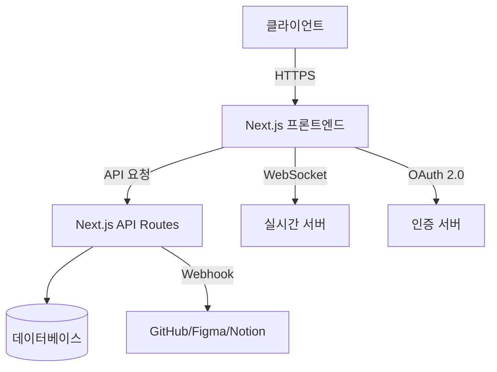

# 🚀 TeamUp - 원격 협업 플랫폼


[](https://opensource.org/licenses/MIT)
[](https://nextjs.org/)
[](https://www.typescriptlang.org/)

> **"Create. Collaborate. Code. Together."**  
> 당신의 아이디어, 팀이 되어 현실로.

---

## 📋 프로젝트 개요

### 🎯 해결하려는 문제
- 원격 근무가 일상화된 환경에서의 효율적인 프로젝트 관리 어려움
- 팀원 간 소통 및 협업의 비효율성
- 작업 진행 상황 파악의 어려움
- 여러 도구 간의 연동 불편함

### 💼 비즈니스 가치
- **생산성 향상**: 통합된 협업 도구로 작업 효율성 극대화
- **비용 절감**: 여러 도구 구독 대신 하나의 플랫폼으로 통합
- **확장성**: 모듈식 아키텍처로 기능 추가 및 확장 용이
- **데이터 기반 의사결정**: 프로젝트 메트릭 및 분석 제공

### ✨ 차별화 포인트
1. **통합된 협업 환경**: 채팅, 작업 관리, 일정 관리를 한 곳에서
2. **실시간 데이터 시각화**: 프로젝트 진행 상황을 직관적으로 파악
3. **사용자 경험 중심**: 직관적인 UI/UX로 학습 곡선 최소화
4. **확장 가능한 아키텍처**: 팀의 성장에 맞춰 확장 가능

## 🛠 주요 기능 및 활용 사례

### 📊 프로젝트 관리 대시보드
- **기능**: 프로젝트 전반의 진행 상황을 한눈에 파악
- **활용 사례**: 매주 월요일 팀 회의에서 대시보드를 통해 주간 목표 설정 및 진행 상황 공유

### 📅 작업 관리 (칸반 보드)
- **기능**: 드래그 앤 드롭으로 작업 상태 관리
- **활용 사례**: 스프린트 기반으로 작업을 진행하며, 각 작업의 진행 상태를 실시간으로 공유

### 💬 실시간 채팅
- **기능**: WebSocket 기반의 실시간 메시징
- **활용 사례**: 팀원들과의 빠른 소통 및 의사결정

### 📹 화상 회의
- **기능**: WebRTC를 활용한 고품질 화상 통화
- **활용 사례**: 주간 스탠드업 미팅 또는 이슈 해결을 위한 즉석 회의

### 📈 데이터 분석
- **기능**: 팀원별 기여도, 작업 완료율 등의 분석
- **활용 사례**: 분기별 성과 평가 및 리소스 배분 계획 수정

## 🏗️ 아키텍처 개요



## 📂 프로젝트 구조

```
team-up/
├── public/                 # 정적 파일 (이미지, 아이콘 등)
│   ├── icons/             # 아이콘 에셋
│   └── json/              # JSON 데이터 파일
│
├── src/
│   ├── app/               # Next.js 앱 라우터
│   │   ├── about/         # 소개 페이지
│   │   ├── api/           # API 라우트
│   │   ├── auth/          # 인증 관련 페이지
│   │   └── platform/      # 메인 플랫폼 페이지
│   │
│   ├── auth/              # 인증 관련 로직
│   ├── components/        # 재사용 가능한 컴포넌트
│   │   ├── platform/      # 플랫폼 전용 컴포넌트
│   │   ├── project/       # 프로젝트 관련 컴포넌트
│   │   └── ui/            # UI 컴포넌트 (DatePicker, Accordion 등)
│   │
│   ├── contexts/          # React 컨텍스트
│   ├── hooks/             # 커스텀 훅
│   ├── layouts/           # 페이지 레이아웃
│   ├── types/             # TypeScript 타입 정의
│   └── lib/               # 유틸리티 함수
│
├── .github/               # GitHub 관련 설정
├── .eslintrc.json         # ESLint 설정
├── next.config.ts         # Next.js 설정
├── package.json           # 의존성 및 스크립트
└── tsconfig.json          # TypeScript 설정
```

## 🛠 개발 환경 설정

### 필수 조건
- Node.js 18.0.0 이상
- npm 9.0.0 이상 또는 yarn 1.22.0 이상
- Git

### 로컬 개발 환경 설정

1. 저장소 클론
   ```bash
   git clone https://github.com/your-org/team-up.git
   cd team-up
   ```

2. 의존성 설치
   ```bash
   npm install
   # 또는
   yarn install
   ```

3. 환경 변수 설정 (`.env.local` 파일 생성)
   ```env
   # 필수 환경 변수
   NEXT_PUBLIC_API_URL=http://localhost:3000
   NEXT_PUBLIC_FIREBASE_API_KEY=your_firebase_api_key
   NEXT_PUBLIC_FIREBASE_AUTH_DOMAIN=your_project.firebaseapp.com
   
   # 선택적 환경 변수
   NODE_ENV=development
   ```

4. 개발 서버 실행
   ```bash
   npm run dev
   # 또는
   yarn dev
   ```

5. 브라우저에서 확인
   ```
   http://localhost:3000
   ```

## 🛠 기술 스택

### 프론트엔드
- **프레임워크**: Next.js 13+ (App Router)
- **상태 관리**: Zustand, React Context
- **스타일링**: Tailwind CSS
- **UI 컴포넌트**: Headless UI, Radix UI
- **차트**: Recharts
- **드래그 앤 드롭**: @dnd-kit
- **에디터**: @uiw/react-md-editor

### 백엔드
- **런타임**: Node.js
- **API**: Next.js API Routes
- **인증**: Firebase Authentication
- **데이터베이스**: (백엔드 서버에 따라 다름)

### 인프라
- **호스팅**: Vercel (프론트엔드), AWS (백엔드)
- **CI/CD**: GitHub Actions
- **모니터링**: Sentry, LogRocket

## 🧪 테스트

### 단위 테스트 실행
```bash
npm test
# 또는
yarn test
```

### E2E 테스트 실행
```bash
npm run test:e2e
# 또는
yarn test:e2e
```

### 테스트 커버리지 확인
```bash
npm run test:coverage
# 또는
yarn test:coverage
```

## 🚀 배포

### 스테이징 환경
```bash
# 스테이징 브랜치에 푸시 시 자동 배포
git push origin feature/your-feature:staging
```

### 프로덕션 환경
1. 메인 브랜치에 PR 생성
2. 코드 리뷰 진행
3. 메인 브랜치 머지 시 자동 배포

## 🔒 보안 및 개인정보 보호

### 데이터 보호
- 모든 통신은 HTTPS 암호화
- 민감한 정보는 환경 변수로 관리
- 정기적인 보안 감사 수행

### 인증 및 권한
- JWT 기반 인증
- 역할 기반 접근 제어(RBAC)
- 2단계 인증(2FA) 지원

### 개인정보 처리 방침
- 사용자 데이터는 암호화되어 저장
- 데이터 보존 정책 준수
- GDPR 및 개인정보보호법 준수

## 🤝 팀 협업 가이드라인

### 브랜치 전략
- `main`: 안정적인 릴리스 브랜치
- `develop`: 개발 브랜치
- `feature/`: 기능 개발 브랜치
- `hotfix/`: 긴급 수정 브랜치

### 커밋 메시지 컨벤션
```
type(scope): 제목

본문 (선택사항)

꼬리말 (선택사항)
```

**타입 목록**:
- `feat`: 새로운 기능 추가
- `fix`: 버그 수정
- `docs`: 문서 수정
- `style`: 코드 포맷팅, 세미콜론 누락 등
- `refactor`: 코드 리팩토링
- `test`: 테스트 코드 추가/수정
- `chore`: 빌드 과정 또는 보조 기능 수정

### 코드 리뷰
- 모든 PR은 최소 1명 이상의 리뷰 필요
- 코드 리뷰는 24시간 이내에 진행
- 리뷰어는 PR 작성자에게 명확한 피드백 제공

## 📅 향후 로드맵

### 단기 목표 (3개월)
- [ ] 실시간 협업 에디터 추가
- [ ] 모바일 앱 출시
- [ ] 통합 캘린더 기능 강화

### 중기 목표 (6개월)
- [ ] AI 기반 작업 추천 시스템
- [ ] 고급 분석 대시보드
- [ ] 타임트래킹 통합

### 장기 목표 (1년 이상)
- [ ] 워크플로우 자동화 빌더
- [ ] 마켓플레이스 통합
- [ ] 글로벌 확장 (다국어 지원)

## 📄 라이센스

이 프로젝트는 [MIT 라이센스](LICENSE)를 따릅니다.

---

<div align="center">
  <p>© 2025 TeamUp. All rights reserved.</p>
</div>

TeamUp은 함께 만들어가는 플랫폼입니다.

기여, 아이디어 제안, 피드백 모두 환영합니다!
